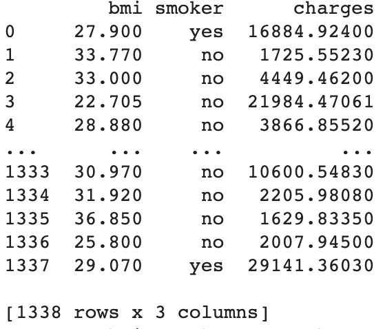

# Preview
In this lab, you’ll use a multiple linear regression machine learning algorithm to estimate a person’s medical insurance cost with his or her BMI(Body Mass Index) and whether he or she is a smoker.

# Getting set up

## Import Libraries for Linear Regressions

	import pandas as pd
	import numpy as np
	import matplotlib.pyplot as plt
	from sklearn.linear_model import LinearRegression
	from sklearn.model_selection import train_test_split

## Import Data File from Google Drive

	# Code to read csv file into Colaboratory:
	!pip install -U -q PyDrive
	from pydrive.auth import GoogleAuth
	from pydrive.drive import GoogleDrive
	from google.colab import auth
	from oauth2client.client import GoogleCredentials
	# Authenticate and create the PyDrive client.
	auth.authenticate_user()
	gauth = GoogleAuth()
	gauth.credentials = GoogleCredentials.get_application_default()
	drive = GoogleDrive(gauth)

	link = 'https://drive.google.com/open?id=15qJFX87eHO7OWJyjJYIli7VejqW-aGvD' # The shareable link
	fluff, id = link.split('=')
	# Verify that you have everything after '='
	downloaded = drive.CreateFile({'id':id}) 
	downloaded.GetContentFile('insurance2.csv')  
	df3 = pd.read_csv('insurance2.csv')
	print(df3)
	
The format of this Pandas Dataframe should be the following.

	
# Dataset is now stored in a Pandas Dataframe
Smoker = {'yes': 1,'no': 0} 
df3.smoker = [Smoker[item] for item in df3.smoker]
print(df3)

